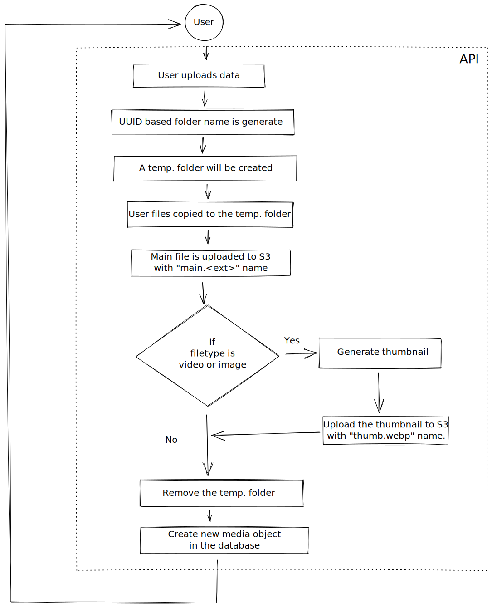

# Media Management

This document describes how CourseLit handles user uploaded media like images, videos, audio, pdf and more.

CourseLit can store user media on any [AWS S3](https://aws.amazon.com/s3/) compatible cloud storage like AWS S3 or [DigitalOcean Spaces](https://www.digitalocean.com/products/spaces).

All the uploads are private by default unless specified during the upload.

## Settings

You need to specify the following environment variables for booting up the service correctly.

```bash
CLOUD_ENDPOINT=https://cloud.endpoint
CDN_ENDPOINT=https://cdn.endpoint
CLOUD_REGION=region
CLOUD_KEY=key
CLOUD_SECRET=secret
CLOUD_BUCKET_NAME=bucket
```

## Temporary folder for helping uploads

When you upload a content to CourseLit, the content is first uploaded to the CourseLit server and then to the cloud. Hence, you need to specify a folder on the server where such uploads are stored until they are uploaded to the cloud storage.

To specify the temporary upload folder, set the following environment variable.

```
TEMP_DIR_FOR_UPLOADS=/path/to/temp/folder
```

## Thumbnail generation

CourseLit generates thumbnails for image and video files and stores them along with the original file. The temporary folder specified above is used for thumbnail generation.

## Storage convention

CourseLit saves user files in a pre-defined fashion which is specified below.

```bash
Actual file: <storage-root>/{subdomain-name}/{user-id}/{uuid}/main.webp
Thumbnail file: <storage-root>/{subdomain-name}/{user-id}/{uuid}/thumb.webp
```

## Flow diagram



[Link to the original diagram](https://excalidraw.com/#json=5081053140090880,IjHDBI09H4htO71ODKUAeg)
